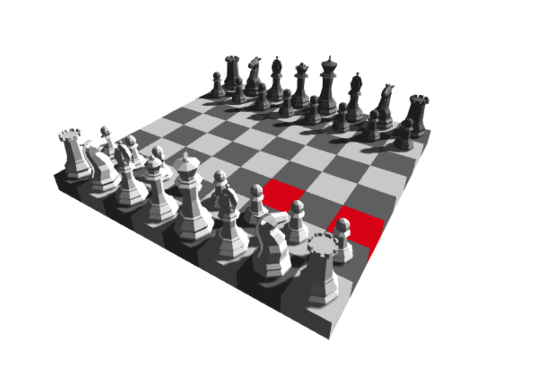

# Chess3D
 A 3D chess game made for the browser using ThreeJS
- To run frontend `npm start;`
- To start backend `npm run server;`

# To do
- [ ] Fix Cors errors 
- [ ] Room 
    - Phase 1: Anyone can see the game and move any piece
        - `/room/2` determines the lobby id
        - backend stores the id, and the state 
    - Phase 2: whoever creates the room is white and based on that we have a competitive mode
        - client that creates room will be given a player id and room id. Client sends to friend
            - when you create the room `/room/2/id/231` 
            - you share: `/room/2/`
        - When friend arrives and does not have an id, yet the socket server assigns one
    - Phase 3: Logged in accounts where your account limits which side you are on
        - account
            - password
            - email
        - per game, we need to keep track of
            - play 1 and 2's id and their color in the game

# Conventional Commit
- We use conventional commits to automatically version the project
- Major version: feat(feature_name); comment here 
- Minor version: fix(fix_name); comment here
